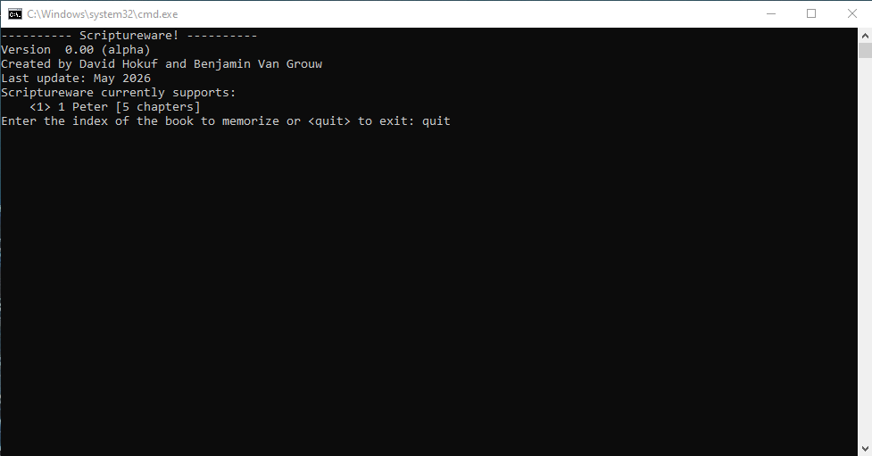
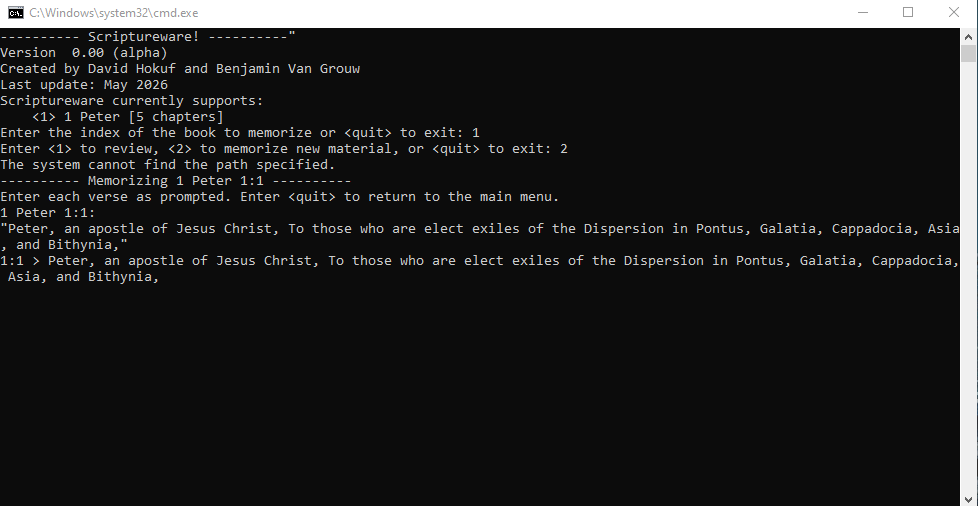
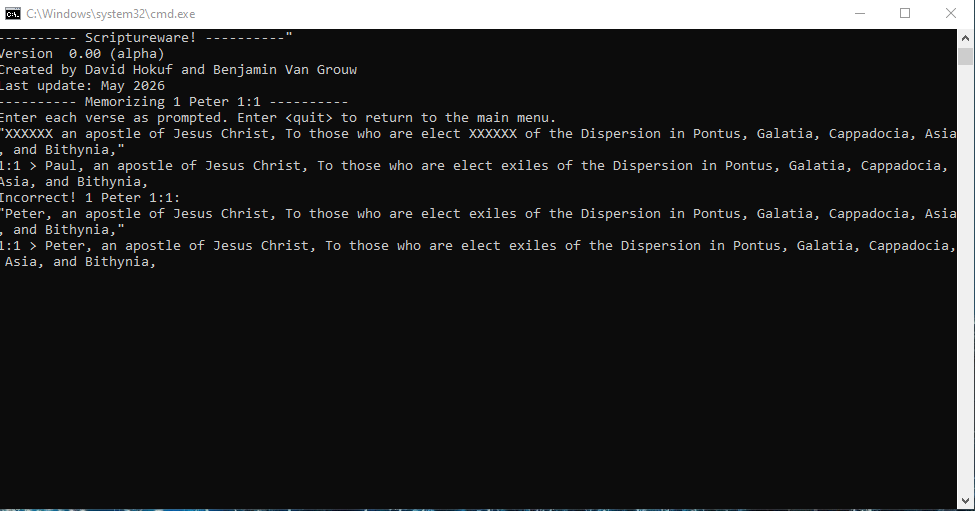
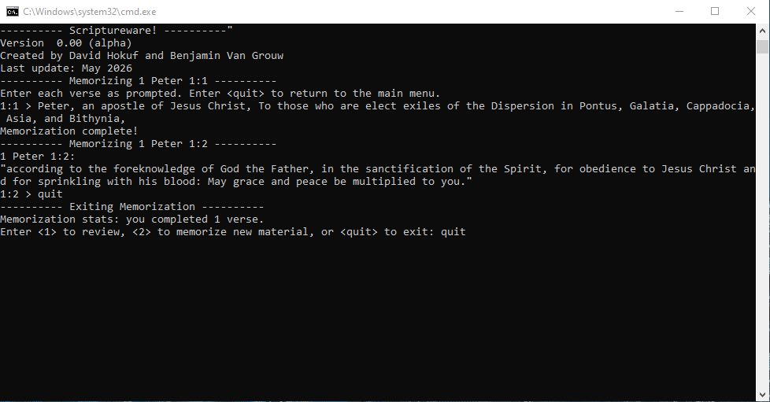

# Functionality

## v1.0.0

### Main Menu

The main menu allows the user to select between learning and reviewing modes.

### Review Mode

Review mode prompts the user to enter verses one at a time. If a verse is entered incorrectly, the correct text is displayed and the user is prompted to retype the correct text.

### Memorization Mode

Memorization mode helps the user memorize a new verse by displaying the complete text of the verse and then removing two words at a time from the verse. First, the complete text is displayed and the user is prompted to copy it:

Next, the lines containing the text of the verse are erased and the verse is re-displayed with two words removed. The user is prompted to enter the complete verse. If the verse is entered incorrectly, the complete verse is displayed and the user is prompted to re-enter it before continuing.

Finally, when the verse is completely memorized, the program moves on to the next verse in sequence.

