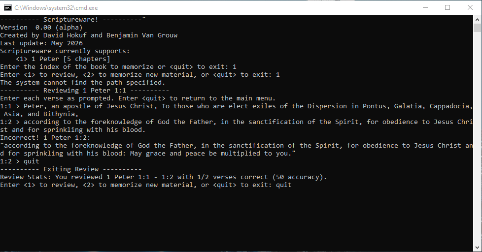

# Functionality

## Main Menu

The main menu allows the user to select between learning and reviewing modes.

### Review Mode

Review mode prompts the user to enter verses one at a time. If a verse is entered incorrectly, the correct text is displayed and the user is prompted to retype the correct text.
